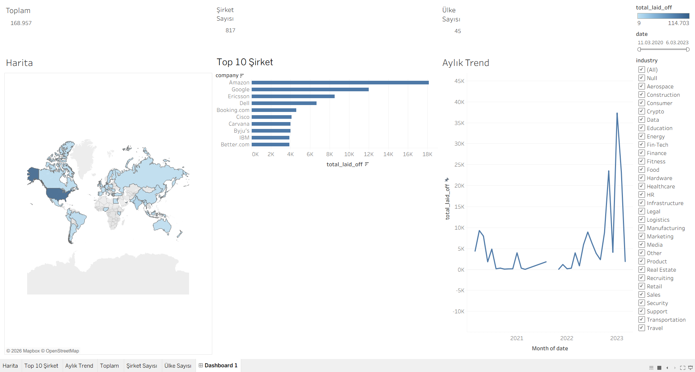

# SQL Layoffs Data Cleaning & Analysis

##  Proje Hakkında

Bu projede, gerçek bir işten çıkarma (Layoffs) veri seti üzerinde MySQL kullanılarak veri temizleme ve keşifsel veri analizi (EDA) gerçekleştirilmiştir.

Proje kapsamında veri seti temizlenmiş, tutarsız veriler düzeltilmiş ve SQL sorguları kullanılarak çeşitli analizler yapılmıştır.

---

##  Kullanılan Teknolojiler

- MySQL

---

## 📚 Kullanılan SQL Konuları

- Veri Temizleme (Data Cleaning)
- Common Table Expressions (CTE)
- Window Functions
- ROW_NUMBER()
- DENSE_RANK()
- JOIN
- GROUP BY
- Aggregate Functions
- Date Functions
- NULL Değer Yönetimi

---

##  Proje Yapısı

- `layoffs.csv` → Projede kullanılan veri seti
- `01_data_cleaning.sql` → Veri temizleme işlemleri
- `02_exploratory_data_analysis.sql` → Keşifsel veri analizi (EDA)
- `03_advanced_sql.sql` → İleri SQL sorguları (CTE, Window Functions, DENSE_RANK vb.)

---

##  Projede Yapılanlar

- Geçici (Staging) tablo oluşturuldu.
- Yinelenen (Duplicate) kayıtlar kaldırıldı.
- Tutarsız veriler standartlaştırıldı.
- NULL ve boş değerler düzenlendi.
- Tarih sütunu uygun veri tipine dönüştürüldü.
- Şirket, sektör, ülke ve yıllara göre analizler gerçekleştirildi.
- CTE ve Window Functions kullanılarak gelişmiş SQL sorguları oluşturuldu.

---

## 📊 Tableau Dashboard

Temizlenen veri, Tableau Public kullanılarak interaktif bir dashboard'a dönüştürülmüştür.

🔗 **[İnteraktif Dashboard'u Görüntüle](https://public.tableau.com/app/profile/aleyna.ifciba/viz/Book1_17698638922070/Dashboard1)**

### Dashboard İçeriği
- **Toplam İşten Çıkarma Sayısı, Şirket Sayısı, Ülke Sayısı**: Genel özet KPI kartları
- **Dünya Haritası**: Ülkelere göre toplam işten çıkarma dağılımı
- **Top 10 Şirket**: En çok işten çıkarma yapan 10 şirket
- **Aylık Trend**: 2020-2023 arası zaman içindeki işten çıkarma eğilimi
- **Filtreler**: Tarih aralığı ve sektöre göre interaktif filtreleme

### Kullanılan Araç
- Tableau Public

